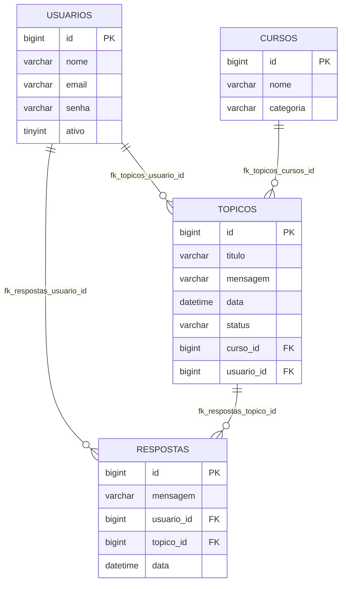

# forumHub
# Projeto ForumHub

Desafio Fórum Hub da Alura e Oracle: uma API REST para gerenciar tópicos e respostas similar a fóruns, com autenticação de usuários e regras de negócios específicas para interação.

## Funcionalidades

- Buscar livro da API e inserir no banco de dados Postgres
- Cadastrar usuários
- Listar usuários registrados
- Inserir, atualizar e excluir tópicos
- Responder e excluir respostas
- Autenticar
- Excluir usuários

## Regras de negócio

- Apenas usuários logados podem inserir tópicos e ver cursos
- Respostas podem ser deletadas apenas pelos criadores das respostas ou dos tópicos
- Tópicos podem ser deletados apenas pelos seus criadores
- Usuários podem ser deletados apenas por si próprios e devem estar logados

## Diagrama ER



## Como usar

Para fazer autenticação, basta rodar o projeto localmente e usar os endpoints abaixo ou usando a interface swagger-ui:

http://localhost:8080/swagger-ui/index.html#/

Login

Para fim de teste, a aplicação possui migration com esses dados já inseridos. Basta acessar com os dados abaixo.

- POST /login
```
Request Body:
{
    "email": "teste@mail.com",
    "senha": "123456"
}

```
Cadastrar usuário

- POST /cadastro_usuario

```
Request Body:
{
    "nome": "Nome do Usuário",
    "email": "usuario@example.com",
    "senha": "senha123"
}
```
Listar usuários
- GET /usuarios

Deletar usuário

- DELETE /usuarios/{id}

Listar Cursos

- GET /cursos
```
Authorization: Bearer token_jwt_aqui
```
Detalhar Curso
- GET /cursos/{id}
```
Authorization: Bearer token_jwt_aqui
```

Criar Tópico
- POST /topicos
```
Authorization: Bearer token_jwt_aqui

Request Body:
{
    "titulo": "Título do Tópico",
    "mensagem": "Mensagem do Tópico",
    "curso_id": 1,
    "usuario_id": 1
}
```
Listar Tópicos

- GET /topicos
```
Authorization: Bearer token_jwt_aqui
```
Detalhar Tópico

- GET /topicos/{id}
```
Authorization: Bearer token_jwt_aqui
```

Atualizar Tópico

- PUT /topicos/{id}
```
Authorization: Bearer token_jwt_aqui

Request Body:
{
    "titulo": "Novo Título",
    "mensagem": "Nova Mensagem"
}
```
Excluir Tópico

- DELETE /topicos/{id}
```
Authorization: Bearer token_jwt_aqui

Request Body:
{
    "usuario_id": 1
}
```
Criar Resposta
- POST /respostas
```Request Body:
{
    "mensagem": "Mensagem da Resposta",
    "usuario_id": 1,
    "topico_id": 1
}
```
Excluir Resposta
- DELETE /respostas/{id}
